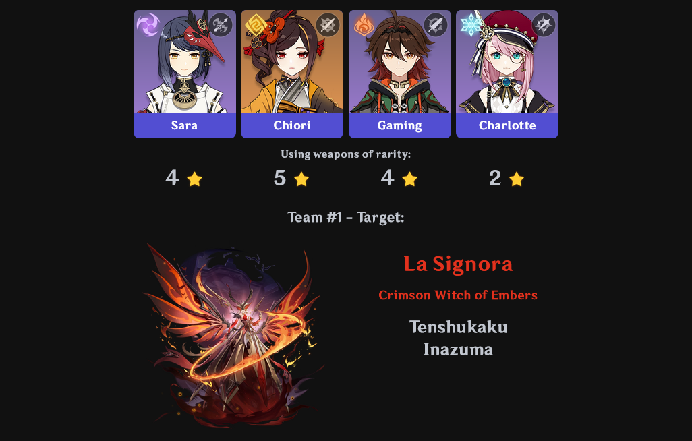
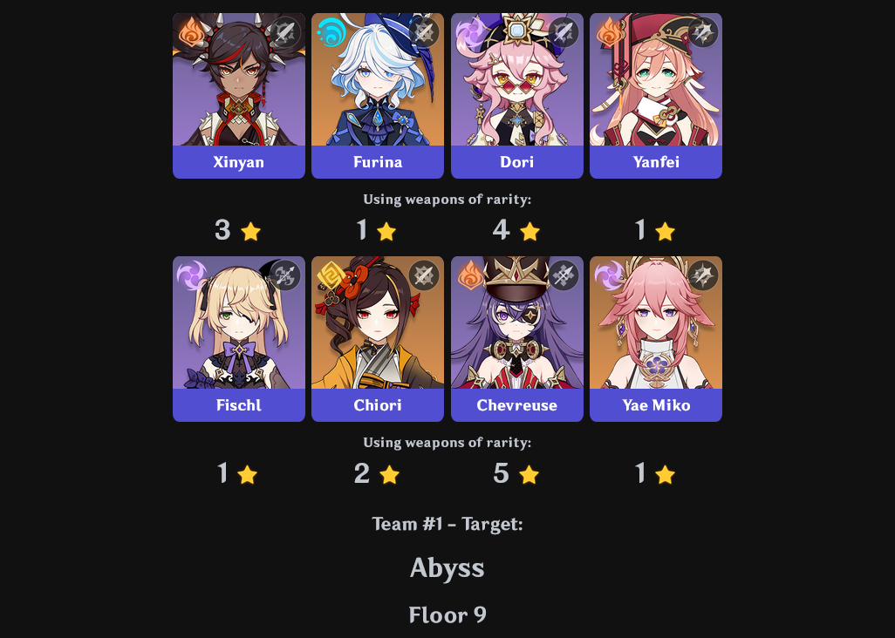

# [Genshin Impact Team Randomizer](https://genshin-randomizer.pana.moe/)
Yet another randomizer for Genshin Impact teams. Create multiple teams without repeated characters with a host of available filters/restrictions, generate a target (boss, domain, etc.) for each team, create co-op overworld teams (i.e. with duplicate characters on a single team), and restrict what weapons you're allowed to use. 

### Usage:
Uncheck any characters you don't have or specifically don't want to include in the pool of possible characters.
Choose a type of team to generate, and optionally a target to use that team against. For filtering purposes, choose whether or not the Traveler should be associated with the region from where they obtained their elements (e.g. Anemo Traveler = Mondstadt, Geo Traveler = Liyue).

Can be used to quickly generate teams like:
* mono-element (e.g. Dendro only)
* mono-weapon (e.g. swords only)
* release date/patch-restricted (e.g. only characters before 2022, or only characters released between patch 2.0 and 3.0)
* multiple unique teams for back-to-back challenges

### Examples:

## Type of Team to Generate
- **Normal**

	4 unique characters.

- **Abyss**

	8 unique characters.

- **Co-Op Overworld**

	4 characters, can include duplicates.

## Traveler?
One of:
- **Aether**
- **Lumine**
- **Both**

## Traveler Element Associated with Region?
- **(True / False)**
	
	If selected, Anemo Traveler = Mondstadt, Geo Traveler = Liyue, etc., otherwise their region will be considered "none".

## Single Element Traveler?
*(Only if multiple teams are being generated.)*
- **(True / False)**

	Only applies if multiple teams are being generated. If checked, the Traveler will be considered a single unique character that may only appear once, e.g. if Electro Traveler is randomly selected, then Anemo/Geo/Hydro/Pyro/Cryo will be removed from the pool of possible characters going forward. Otherwise, with the exception of Abyss paired teams, a Traveler of each element will exist in the pool of possible characters, e.g. team 1 may have Anemo Traveler, then team 2 may have any selected Traveler except Anemo.

## Weapon Rarity Restriction (optional)
- **Disabled**

	Don't generate weapon restrictions.
- **Random (single)**

	If checked, will pick one of the selected rarities and all characters must use that rarity, e.g. all characters must use 3 star weapons.
- **Random (varied)**

	If checked, will pick one of the selected rarities for each character separately, e.g. character 1 gets a 3 star weapon, character 2 get a 5 star, character 3 gets a 2 star, and character 4 gets a 3 star.

+ Multiple selectable options of:
	+ 1
	+ 2
	+ 3
	+ 4
	+ 5

## Target (optional)
+ Multiple selectable options of:
	+ Overworld boss
	+ Domain
	+ Abyss floor

	*(Only if multiple teams are being generated.)*

- **New target for each team?**

	**(True / False)**
	Only applies if multiple teams are being generated. Generate a new target for each team.

## Number of Unique Teams to Generate
- **Maximum of ((total number of characters) / (team size of [4, 8])) teams, rounded up.**

	If there are 80 characters possible, can generate a maximum of 10 unique Abyss team pairs, or 20 unique normal teams. Useful for continuous challenges by preventing repeat characters across multiple sequential teams, e.g. having a character on the first team means they won't be available for any subsequent teams.

## Filters

### Element
+ Multiple selectable options of:
	+ Geo
	+ Dendro
	+ Cryo
	+ Pyro
	+ Hydro
	+ Electro
	+ Anemo

### Weapon
+ Multiple selectable options of:
	+ Sword
	+ Bow
	+ Claymore
	+ Polearm
	+ Catalyst

### Stars
+ Multiple selectable options of:
	+ 4 stars
	+ 5 stars

### Region
+ Multiple selectable options of:
	+ Mondstadt
	+ Liyue
	+ Inazuma
	+ Sumeru
	+ Fontaine
	+ Natlan (at the time of writing, none 😔)
	+ Snezhnaya

### Model
+ Multiple selectable options of:
	+ Tall Female
	+ Medium Female
	+ Short Female
	+ Tall Male
	+ Medium Male
	+ Short Male (at the time of writing, only Xiao 😔)

### Patch
One of:
- **Before**
- **After**
- **Between**

	+ Dropdown select (2 for "between" patch range).

### Release Date
One of:
- **Before**
- **After**
- **Between**

	+ Calendar for date input (2 for "between" date range).

###### Character data/font/images belong to Hoyoverse, mostly extracted from the [character list on the unofficial wiki](https://genshin-impact.fandom.com/wiki/Character/List) since they have a neat table already. [Fitty](https://github.com/rikschennink/fitty) used for resizing text in the character cards. [Pico](https://github.com/picocss/pico) used for styling components.
